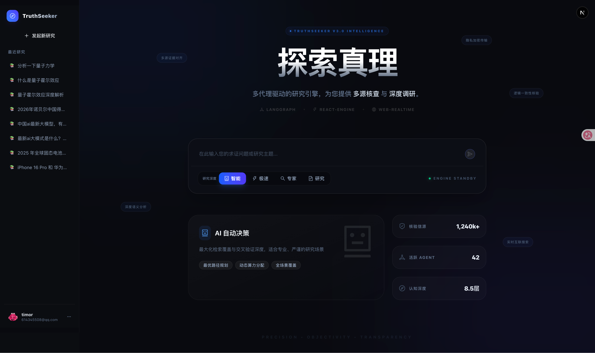
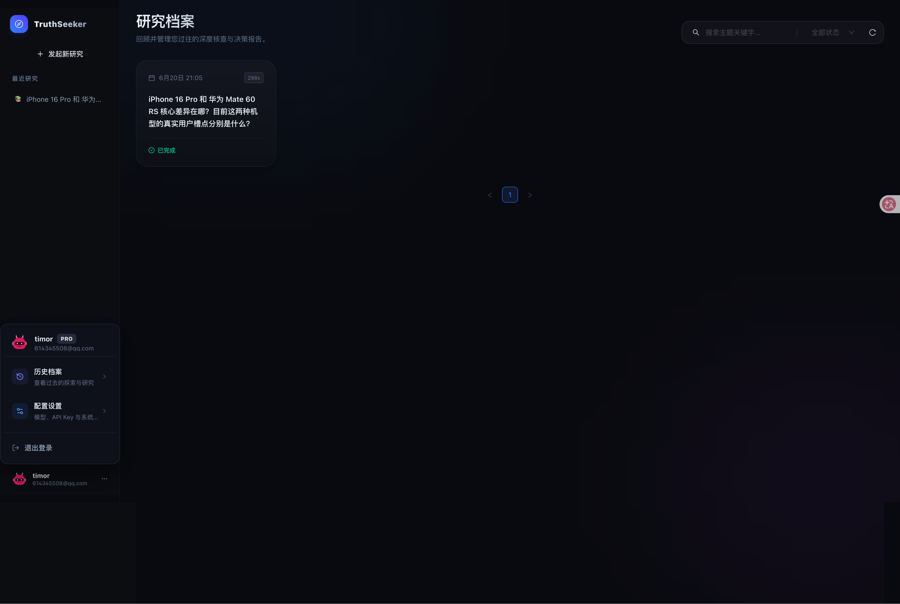
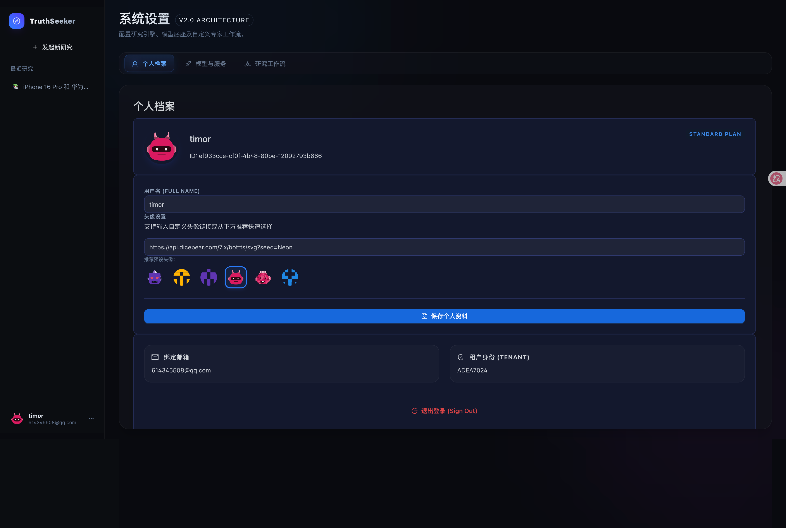
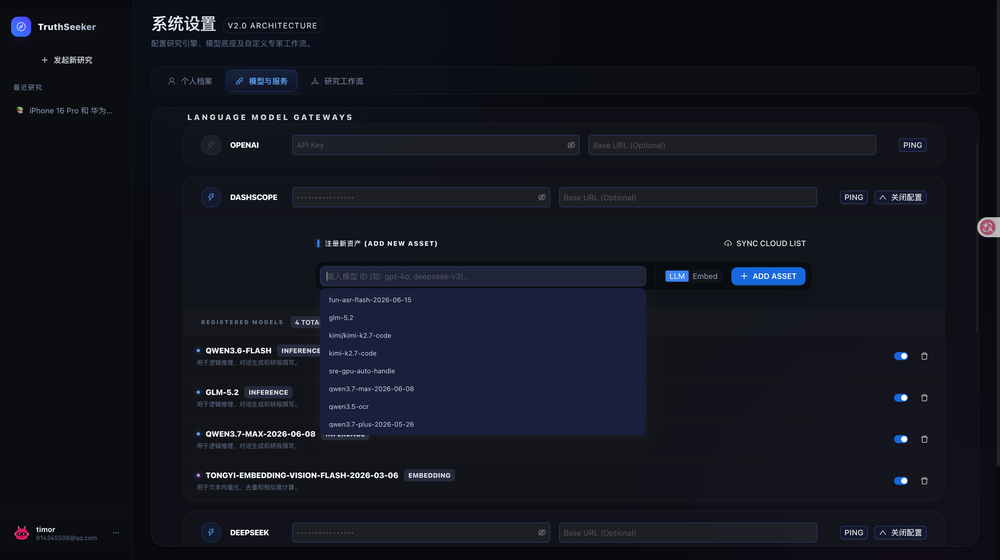
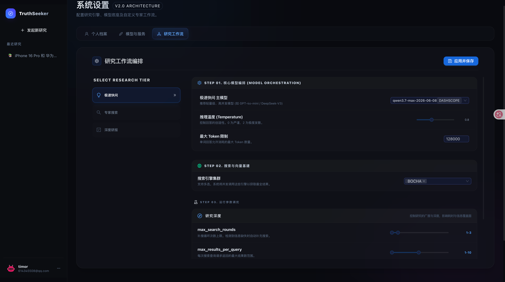
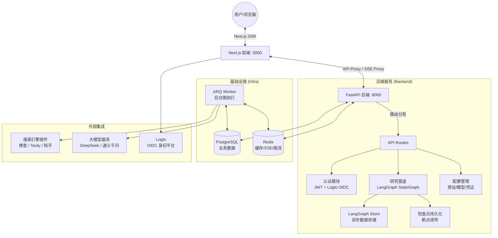
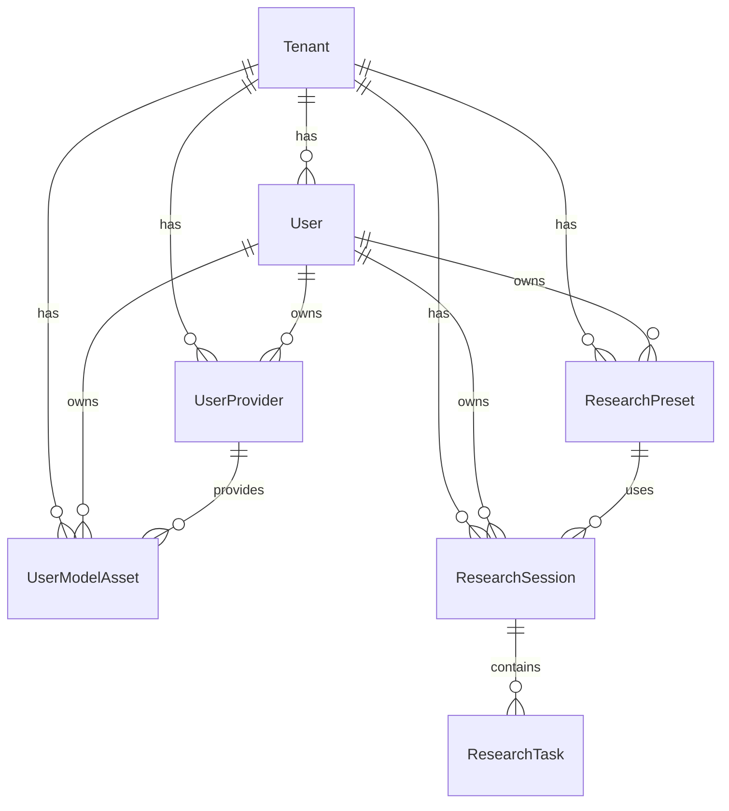
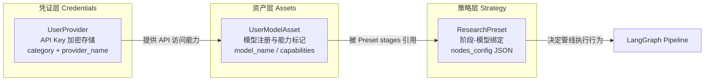
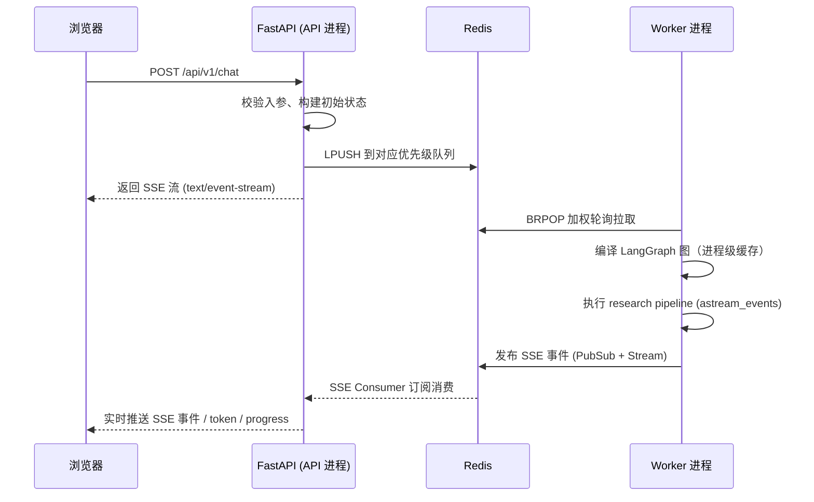

# 🔍 TruthSeeker (真理追寻者)

> **SaaS 多租户的深度研究与信源核查引擎** — 基于 LangGraph 状态机驱动的 AI 研究管道，从多维度拆解问题、并发检索全网信源、交叉验证事实一致性，最终生成附带置信度评分和全链路溯源的结构化研究报告。

[](https://www.python.org/)
[](https://fastapi.tiangolo.com/)
[](https://langchain-ai.github.io/langgraph/)
[](https://nextjs.org/)
[](LICENSE)

---

## 📖 目录

- [产品概览](#-产品概览)
- [核心架构](#-核心架构)
- [核心特性](#-核心特性)
- [研究管道深度解析](#-研究管道深度解析)
- [快速开始](#-快速开始)
- [配置指南](#-配置指南)
- [开发指南](#-开发指南)
- [部署](#-部署)
- [API 概览](#-api-概览)
- [项目结构](#-项目结构)
- [技术栈](#-技术栈)
- [常见问题](#-常见问题)
- [开源协议](#-开源协议)

---

## 🎯 产品概览

TruthSeeker 是一个**专业级的深度研究自动化工具**。它不只是一个简单的"搜索+总结"链式调用，而是一个 **有状态的、支持循环递归与中断恢复的异步研究状态机**。

### 它能做什么？

| 场景 | 说明 | 推荐模式 |
|------|------|----------|
| 💬 **日常速查** | 快速回答一个简单问题，如"iPhone 16 Pro 的起售价是多少？" | 极速快问 (Fast React) |
| 🔎 **背景调研** | 深入了解某个主题，如"2025 年全球固态电池商业化进展" | 专家搜索 (Expert Search) |
| 📑 **深度研报** | 对复杂问题进行多维度交叉验证，如"网传 Neuralink 导致感染是真的吗？" | 深度研究 (Research Pipeline) |
| 🤖 **AI 自适应** | 让 AI 自动判断问题复杂度，选择最合适的处理层级 | 智能模式 (Auto) |

### 核心工作流

```
用户提问 → 意图分析 → 多引擎并发搜索 → 信源清洗与过滤
    → 原子声明提取 → 跨源交叉验证 → 裁决 → 报告生成
```

## 📸 功能预览

### 🏠 首页 — 研究入口



*首页展示研究输入界面，支持极速快问、专家搜索、深度研究、智能模式四种模式切换。*

### 💬 研究结果 — 声明验证与报告


*研究结果页包含思考链追踪面板、声明验证卡片（置信度评分 + 信源溯源）和完整 AI 研究报告。*

### 📋 历史记录



*过往研究列表，支持查看、筛选和管理历史研究任务。*

### ⚙️ 设置管理

| 截图 | 说明 |
|------|------|
|  | 账号信息与 API 密钥管理 |
|  | LLM 模型配置与参数调整 |
|  | 研究工作流预设与自定义管线 |

*所有 API 密钥在数据库中使用 AES-256 加密存储。*

---

## 🏗️ 核心架构

### 系统架构总览



### 核心分层

| 层级 | 目录 | 职责 |
|------|------|------|
| **内核层 (Core)** | `backend/core/` | LLM 实例化、加密安全、向量嵌入、全局配置、日志追踪 |
| **接驳层 (API)** | `backend/api/` | FastAPI 路由、SSE 流式协议、Pydantic Schema、JWT 认证 |
| **管线层 (Pipeline)** | `backend/pipeline/` | LangGraph 状态机定义、节点编排、子图嵌套（核查子图） |
| **检索层 (Search)** | `backend/search/` | 插件化搜索引擎集成、并发调度与去重编排 |
| **服务层 (Services)** | `backend/services/` | 业务逻辑：会话管理、上下文解析、SSE 发布订阅 |
| **数据层 (DB)** | `backend/db/` | SQLAlchemy ORM 模型、Alembic 迁移、CRUD 操作 |

---

---

## 🗄️ 数据模型与分层架构

### 实体层级链

多租户隔离的核心在于四级实体链，每一级通过数据库外键级联：



| 实体 | 说明 | 关键字段 |
|------|------|----------|
| `Tenant` | 租户容器，多租户隔离的根实体 | `id`, `external_id` |
| `User` | 用户（隶属租户），支持密码登录与 OIDC 登录 | `email`, `hashed_password`, `role`, `external_id` |
| `ResearchSession` | 研究会话，对应 LangGraph `thread_id` | `title`, `status`, `total_duration_seconds` |
| `ResearchTask` | 单次研究任务，承载查询输入与所有结构化产出 | `query`, `claims`, `sources`, `status`, `overall_confidence` |

### 三层配置模型

与实体链正交，配置数据按职责分为三层，实现**模型与配置的解耦**：



1. **凭证层 (`UserProvider`)**：存储第三方服务（LLM / 搜索引擎）的 API Key，所有密钥在入库时使用 **Fernet (AES-256)** 加密存储。支持自定义 `base_url`，兼容各类私有化部署的 API 端点（如国内代理）和同一供应商多账户管理。

2. **资产层 (`UserModelAsset`)**：注册用户可选用的模型资产，绑定所属 Provider。每个 Asset 记录 `model_name`、`display_name`、`capabilities`（如 `["vision", "tool_call"]`），支持按能力筛选。系统级默认模型和用户自定义模型并存。

3. **策略层 (`ResearchPreset`)**：研究预设的定义，核心是 `nodes_config` 字段（JSON 结构），将管线各阶段绑定到具体模型资产和参数：

   ```json
   {
     "stages": {
       "understanding": { "asset_id": "<uuid>", "temperature": 0.1 },
       "search":        { "asset_id": "<uuid>", "temperature": 0.2 },
       "verification":  { "asset_id": "<uuid>", "temperature": 0.2 },
       "report":        { "asset_id": "<uuid>", "temperature": 0.5 },
       "embedding":     { "asset_id": "<uuid>", "temperature": 0.1 }
     },
     "business": {
       "speed": "research_pipeline",
       "engines": ["bocha", "tavily"],
       "max_results_per_query": {"min": 4, "max": 8}
     }
   }
   ```

   每个管线阶段（understanding / search / verification / report / embedding）独立绑定一个模型 Asset，实现**精细化的算力分配**。这也是 `get_llm_for_stage()` 函数"严格寻址模式"的数据来源。

---

## ✨ 核心特性

### 🔐 多租户与安全
- **Tenant / User 两级数据隔离** — 每个租户拥有完全隔离的研究数据，`ResearchSession` / `ResearchTask` 通过外键级联归属，数据按 `tenant_id` + `user_id` 双维度隔离，删除租户/用户时级联清理
- **API Key AES-256 加密存储** — 用户配置的第三方服务密钥使用 `cryptography.fernet.Fernet`（基于 AES-256-CBC + HMAC 认证加密）加密后存库。支持独立设置 `ENCRYPTION_KEY` 环境变量，实现 JWT 密钥与加密密钥分离轮换
- **SSRF 防护** — 内置 DNS 级 SSRF 检测：通过 `socket.getaddrinfo` 解析 URL 至所有 IP → 逐 IP 判断是否为回环/私有/保留地址 → 拦截内网请求。特殊放行 `198.18.0.0/15` 网段（Clash 等代理工具常用的 RFC 2544 基准测试映射地址），解析异常一律视为不安全
- **PBKDF2 密码哈希** — `480,000` 轮迭代 PBKDF2-SHA256，32 字节输出密钥，16 字节随机盐值。密码验证使用 `hmac.compare_digest` 常量时间比较，抵御时序旁路攻击
- **Logto OIDC 集成** — 可选的外部身份认证平台，后端通过 JWKS 端点获取公钥，校验 RS256 签名 Access Token

### 🧠 智能研究管道 (LangGraph 状态机)
- **有状态可恢复** — 基于 LangGraph Checkpointer，支持断点续传和任务恢复
- **多维度意图拆解** — 将模糊提问拆解为多个具体研究维度，支持向量去重
- **循环迭代搜索** — 根据信息丰富度自动决定是否进行多轮补充搜索
- **分布式锁** — 基于 Redis 的分布式锁，防止同一研究会话并发执行

### ⚖️ "审判室"式交叉验证 (Verify Subgraph)
- **原子化** — 将内容拆解为最小单位的"事实声明 (Claims)"
- **信源画像** — 对每个信源评估内容质量、营销倾向和专业性
- **三方共识** — 针对每条声明，汇聚多源证据判定支持/反对/中立
- **裁决** — 综合加权，在 **Supported (证实)**、**Contradicted (证伪)**、**Unverifiable (无法核实)** 中给出裁决

### ⚡ 三个速度档位

| 档位 | 解释 | 最大维度 | 搜索轮数 | 查结果数/轮 | 验证级别 |
|------|------|----------|----------|------------|---------|
| `fast_react` | 极速快问 — 快速检索总结，日常速查 | 2 | 1 | 3 | 跳过验证 |
| `expert_search` | 专家搜索 — 标准深度检索，背景调研 | 3 | 2 | 5 | 标准验证 |
| `research_pipeline` | 深度研报 — 最大化覆盖，严谨研究 | 3~6 | 1~3 | 4~8 | 严格验证 |

### 🔄 SSE 实时流推送
- **研究进度实时推送** — 工作节点通过 Server-Sent Events 实时推送思考链进度
- **Redis PubSub + Stream 双通道** — 支持实时消费和历史缓冲两种模式
- **断线重连** — 关闭页面后重新打开可恢复研究状态，继续消费结果

### 📊 全链路溯源与可视化
- **每条声明附带置信度评分** — 从 `verified` 到 `unverifiable` 五级判定
- **信源溯源** — 每条声明均可追溯至原始网页及信源主页
- **冲突检测** — 识别信源间的数据/观点矛盾，高亮冲突维度

---

## 🔬 研究管道深度解析

### 主图流程

TruthSeeker 的核心在 `backend/pipeline/graph.py` 中定义，是一个完整的 LangGraph `StateGraph`：

```
策略规划 (strategy_planner)
    │
    ├── fast_react / expert_search 模式 → Agent 节点 (自主搜索+生成)
    │
    └── research_pipeline 模式 → 意图分析 (intent_analyze)
                                      │
                                      ↓
                                  搜索规划 (search_react)
                                      │
                                      ↓
                                  粗过滤 (coarse_filter)
                                      │
                                      ↓
                                  LLM 精过滤 (llm_filter)
                                      │
                                      ↓
          ┌──────────────── 核验子图 (cross_verify) ────────────────┐
          │                                                         │
          │  atomize → profile → tripartite → arbitrate            │
          │  提取声明   信源画像   三方共识     裁决                │
          │                                                         │
          └─────────────────────────────────────────────────────────┘
                                      │
                    ┌─────────────────┴─────────────────┐
                    │                                     │
              存在冲突维度                            无冲突或已达最大轮数
           → 返回搜索 (search_react)                 → 报告生成
                                                          │
                                                          ↓
                                                      总结节点 → END
```

### Agent 子图

TruthSeeker 内置了两个独立的 Agent 子图，路由取决于执行模式：

| 子图 | 文件路径 | 适用模式 | 职责 |
|------|----------|----------|------|
| **标准 ReAct Agent** | `subgraphs/agent/graph.py` | `fast_react`， `expert_search` | 自主调用搜索引擎和 Reader 工具，多轮迭代直接生成回答 |
| **搜索规划 Agent** | `subgraphs/search_react/graph.py` | `research_pipeline`（意图分析后） | 关键词生成、搜索策略规划，不直接生成回答，结果由后续主图节点处理 |

- **标准 ReAct Agent** 使用通用工具调用模式（`create_react_agent`），拥有搜索和内容读取能力，适合快速问答和中等深度的调研场景。其内部模型的思考过程通过 `suppress_model_stream` 上下文变量控制是否推送到前端。
- **搜索规划 Agent** 仅负责制定搜索策略（关键词扩展、多语言/年份配置），搜索结果由后续的主图节点（粗过滤 → LLM 精过滤 → 核验子图）处理。

### 核验子图详解 (Verify Subgraph)

`backend/pipeline/subgraphs/verify/graph.py` — 这是 TruthSeeker 最独特的设计：

1. **atomize（原子化）**：从清洗后的搜索结果中，按维度提取独立的事实声明，每条声明标注重要级别（primary / secondary / indirect）和关联信源索引
2. **profile（信源画像）**：评估每个信源的内容质量（0~1）、营销倾向、专家证据引用情况
3. **tripartite（三方共识）**：对每条声明，从所有信源中拉取相关证据，判定一致性：
   - `consistent` — 2+ 信源完全一致
   - `mostly_consistent` — 大体一致，数值误差在 5% 以内
   - `contradictory` — 存在物理性矛盾
   - `single_source` — 仅一个信源提及
   - `unverifiable` — 无可证证据
4. **arbitrate（裁决）**：综合所有判定，给出最终裁决和全局置信度

### 状态管理 (`ResearchState`)

所有节点共享一个 `ResearchState`（定义在 `backend/pipeline/types.py`）：

```
ResearchState:
  ├── context      → 上下文（research_id, tenant_id, user_id, preset_id）
  ├── control      → 控制参数（speed, execution_mode）
  ├── memory       → 记忆（消息历史、已证事实、追问历史、摘要）
  ├── runtime      → 运行时（共享数据、管道状态、Agent 状态）
  └── output       → 输出（报告、声明、诊断信息、置信度）
```

状态通过 **LangGraph Checkpointer** 在每节点执行后自动持久化，支持通过 `thread_id` 完美恢复。

---

## ⚙️ Worker 架构与任务调度

TruthSeeker 采用 **Worker 进程与 API 进程分离** 的架构。API 进程（FastAPI）受理请求后立即入队，Worker 进程（`backend/worker.py`）在后台执行研究管线并通过 SSE 推送结果。

### 三队列加权轮询

Worker 维护三个 Redis List 作为优先级队列，权重策略确保低延迟任务优先被消费：

| 队列 | Redis Key | 权重 | 对应模式 |
|------|-----------|------|----------|
| fast_react | `ts:queue:fast` | **4** | 极速快问 |
| expert_search | `ts:queue:expert` | **2** | 专家搜索 |
| research_pipeline | `ts:queue:pipeline` | **1** | 深度研究 |

加权轮询调度序列：`[fast_react] ×4 → [expert_search] ×2 → [pipeline] ×1`，循环往复。每次 `BRPOP timeout 0.1s` 快速轮转。

### Worker 生命周期



### 关键机制

- **进程级图编译缓存**：`_graph_cache` 缓存编译后的 LangGraph 图及对应的 Checkpointer / Store 实例，避免每次任务重复编译 PostgreSQL 连接池和图的拓扑结构。
- **并发控制**：单 Worker 最多 **2 个并发任务**（`MAX_CONCURRENT_JOBS`），由 `asyncio.Semaphore` 控制，防止 LangGraph 图执行阻塞事件循环。
- **Auto-Scaler 循环**：独立协程监控所有队列的总深度，按三段式策略调整轮询频率：
  - 总深度 < 2 → 休眠 5s（低负载）
  - 总深度 2~10 → 休眠 3s（正常）
  - 总深度 > 10 → 休眠 1s（高压）
- **分布式取消信号**：Worker 通过 Redis PubSub 订阅 `truthseeker:cancellations` 频道，监听来自 API 端（DELETE 请求 / 客户端断开）的取消指令，终止正在执行的图。

### 后台监听器

Worker 启动时间时启动两个后台监听协程：

| 监听器 | Redis 频道 | 用途 |
|--------|-----------|------|
| 取消信号监听 | `truthseeker:cancellations` | 接收任务取消指令并终止图执行，含自动重连逻辑 |
| LLM 缓存失效监听 | `ts:config:invalidate` | 接收模型配置变更广播，清理本进程的 LLM 实例缓存（TTLCache） |

### Worker 入口

```bash
# 调试模式（单 Worker）
python -m backend.worker

# 生产启动（通过 Docker Compose 自动启动）
# 见 docker-compose.yml worker 服务定义
```

---

## 🚀 快速开始

### 前置条件

- [Docker](https://docs.docker.com/get-docker/) & [Docker Compose](https://docs.docker.com/compose/install/)（推荐，或手动安装下方工具）
- Python 3.14+（手动开发时需要）
- Node.js 22+（手动前端开发时需要）
- 一个 [Logto Cloud](https://cloud.logto.io/) 实例（用于身份认证）

### ⚡ 一行命令启动（推荐）

这是最快捷的方式，自动启动所有服务（PostgreSQL + Redis + Backend + Worker + Frontend + Nginx），通过 `http://localhost` 统一入口访问。

```bash
# 1. 克隆仓库
git clone https://github.com/your-org/truth-seeker.git
cd truth-seeker

# 2. 复制环境变量模板（已含 Logto Cloud 凭据示例）
cp .env.docker.example .env
# 编辑 .env，填入 JWT_SECRET_KEY、POSTGRES_PASSWORD

# 3. 一键构建并启动
make deploy
```

启动后通过 **`http://localhost`** 统一访问：
- **前端界面** → http://localhost
- **API 文档 (Swagger UI)** → http://localhost/docs
- **健康检查** → http://localhost/health

所有服务运行在容器内，宿主机只需安装 Docker。Nginx 反向代理统一处理前端页面、API 请求和 SSE 流式通信。

> 查看日志：`make logs` ｜ 停止服务：`make down` ｜ 清空数据：`make clean`

### 🛠️ 方式二：手动本地启动（适合深度开发）

> 宿主机需要安装 Python 3.14+、Node.js 22+、PostgreSQL、Redis。

#### 后端

```bash
# 1. 创建虚拟环境（推荐使用 uv）
pip install uv
uv sync

# 2. 激活虚拟环境
source .venv/bin/activate

# 3. 配置环境变量
cp .env.example .env
# 注释掉 Docker 模式的 DATABASE_URL，取消注释本地 SQLite 行

# 4. 运行数据库迁移
cd backend
alembic upgrade head

# 5. 启动后端服务（热重载）
uv run python backend/main.py
```

#### 前端

```bash
cd frontend
npm install   # 或 yarn install

# 开发模式启动
npm run dev   # 访问 http://localhost:3000
```

---

## ⚙️ 配置指南

### 环境变量

配置文件：`.env`（从 `.env.example` 复制）

#### 必填项

| 变量 | 说明 | 生成方法 |
|------|------|----------|
| `JWT_SECRET_KEY` | JWT 签名密钥，用于签发/验证登录 Token | `python -c "import secrets; print(secrets.token_urlsafe(48))"` |
| `POSTGRES_PASSWORD` | PostgreSQL 数据库密码 | 任意安全密码 |
| `LOGTO_ENDPOINT` | Logto 身份平台地址 | [Logto Cloud](https://cloud.logto.io) 租户端点 |
| `LOGTO_CLIENT_ID` | Logto 应用客户端 ID | 在 Logto 控制台创建应用后获取 |
| `LOGTO_CLIENT_SECRET` | Logto 应用客户端密钥 | 同上 |
| `LOGTO_API_RESOURCE` | API 资源标识符 | 例：`https://api.truthseeker.com` |

#### 选填项

| 变量 | 默认值 | 说明 |
|------|--------|------|
| `DATABASE_URL` | `sqlite+aiosqlite:///./truthseeker.db` | 数据库连接（生产用 PostgreSQL）。Docker 版使用 `postgres` 主机名 |
| `REDIS_URL` | `redis://localhost:6379/0` | Redis 连接地址。Docker 版使用 `redis` 主机名 |
| `ENCRYPTION_KEY` | 从 `JWT_SECRET_KEY` 派生 | AES 加密密钥（独立设置可实现密钥轮换） |
| `FRONTEND_URL` | `http://localhost` | 前端 URL，用于 CORS |
| `CORS_ORIGINS` | `http://localhost` | 允许的跨域来源（逗号分隔） |

> 💡 项目提供了两个环境变量模板：**本地开发**用 `.env.example`（默认 SQLite + localhost），**Docker 启动**用 `.env.docker.example`（适配容器服务名）。复制对应模板即可快速开始。

### API Key 配置（通过 UI）

**不再通过环境变量配置第三方 API Key！** 启动后，登录前端 → **设置** → **API 密钥**，在 UI 中配置以下密钥：

**LLM 提供商（至少配置一个）：**
- **DeepSeek** — 用于意图分析、搜索规划
- **通义千问 (DashScope)** — 用于验证、报告生成、向量嵌入

**搜索引擎（至少配置一个）：**
- **博查 (Bocha)** — 中文搜索引擎
- **Tavily** — AI 原生搜索引擎
- **知乎 (Zhihu)** — 中文知识平台搜索

> 📌 所有 API Key 在数据库中使用 AES-256 加密存储。

### 预设策略 (Presets)

TruthSeeker 提供三个内置预设策略，可通过前端 **设置 → 研究工作流** 自定义：

| 预设 | 速度 | 引擎 | 说明 |
|------|------|------|------|
| `fast_react` | fast_react | bocha | 极速问答 |
| `expert_search` | expert_search | bocha, tavily | 深入搜索 |
| `research_pipeline` | research_pipeline | bocha, tavily | 完整研究管线 |

你可以为每个管线阶段（`understanding`、`search`、`verification`、`report`）**绑定不同的模型和参数**，实现精细化的算力分配。

---

## 💻 开发指南

### 项目结构详解

```
truth-seeker/
├── backend/                        # 🔷 Python 后端 (FastAPI + LangGraph)
│   ├── api/                        # FastAPI 路由层
│   │   ├── app.py                  #   主应用入口，中间件，全局异常处理
│   │   ├── auth.py                 #   JWT 认证 & Logto OIDC 登录
│   │   ├── chat.py                 #   聊天/研究任务发起 API
│   │   ├── research.py             #   研究历史 CRUD API
│   │   ├── settings.py             #   配置管理 API（模型/预设/凭证）
│   │   └── schemas/                #   Pydantic 请求/响应模型
│   ├── core/                       # 核心基础设施
│   │   ├── config.py               #   三层配置管理（环境变量 → 静态常量）
│   │   ├── llm.py                  #   LLM 实例化工厂（缓存 + 自动发现）
│   │   ├── security.py             #   密码哈希、AES 加密、SSRF 防护
│   │   ├── embedding.py            #   向量嵌入服务
│   │   ├── logging.py              #   Loguru 结构化日志（Trace ID 追踪）
│   │   └── registry.py             #   合法值注册表（阶段、提供方、引擎）
│   ├── db/                         # 数据持久层
│   │   ├── models.py               #   ORM 模型（Tenant → User → Session → Task）
│   │   ├── engine.py               #   异步数据库引擎与会话管理
│   │   ├── crud.py                 #   CRUD 操作
│   │   ├── store.py                #   LangGraph Store 语义化封装
│   │   ├── seed.py                 #   种子数据（默认预设/模型资产）
│   │   └── migrate.py              #   迁移工具
│   ├── pipeline/                   # 🔶 LangGraph 研究状态机
│   │   ├── graph.py                #   主图定义 + 条件路由
│   │   ├── state.py                #   状态管理与序列化
│   │   ├── types.py                #   ResearchState 类型定义
│   │   ├── constants.py            #   所有常量唯一来源（安全边界）
│   │   ├── nodes/                  #   主图节点
│   │   │   ├── intent.py           #   意图分析（维度拆解）
│   │   │   ├── strategy.py         #   策略规划
│   │   │   ├── filter.py           #   结果过滤（粗筛 + LLM 精筛）
│   │   │   ├── search_utils.py     #   搜索工具函数
│   │   │   ├── filter_utils.py     #   过滤工具函数
│   │   │   ├── report.py           #   报告生成
│   │   │   └── summary.py          #   总结节点
│   │   ├── subgraphs/              #   子图
│   │   │   ├── verify/             #   "审判室"核查子图
│   │   │   │   ├── graph.py        #     子图定义
│   │   │   │   ├── atomize.py      #     原子声明提取
│   │   │   │   ├── profile.py      #     信源画像
│   │   │   │   ├── tripartite.py   #     三方共识校验
│   │   │   │   ├── arbitrate.py    #     最终裁决
│   │   │   │   └── state.py        #     状态类型
│   │   │   ├── agent/              #   ReAct Agent 子图
│   │   │   └── search_react/       #   搜索规划 Agent 子图
│   │   └── prompts/                #   所有 LLM Prompt 模板
│   │       ├── intent.py           #   意图分析 Prompt
│   │       ├── strategy.py         #   策略规划 Prompt
│   │       ├── search.py           #   搜索规划 Prompt
│   │       ├── filter.py           #   结果过滤 Prompt
│   │       ├── verify.py           #   声明验证 Prompt（最核心）
│   │       └── report.py           #   报告生成 Prompt
│   ├── search/                     # 搜索引擎插件系统
│   │   ├── base.py                 #   插件基类（抽象）
│   │   ├── registry.py             #   插件注册中心
│   │   ├── orchestrator.py         #   并发调度 + 去重编排
│   │   ├── bocha.py                #   博查搜索
│   │   ├── tavily.py               #   Tavily 搜索
│   │   └── zhihu.py                #   知乎搜索
│   ├── services/                   # 业务逻辑层
│   │   ├── research_engine.py      #   LangGraph 引擎封装
│   │   ├── research_lifecycle.py   #   结果归档与结论提取
│   │   ├── chat_service.py         #   聊天与会话管理
│   │   ├── context.py              #   上下文解析（追问历史）
│   │   ├── selector.py             #   预设选择器
│   │   ├── settings_service.py     #   设置服务
│   │   ├── filter_service.py       #   过滤服务
│   │   ├── provider_service.py     #   供应商管理
│   │   ├── embedding_service.py    #   向量化服务
│   │   ├── app_lifecycle.py        #   应用生命周期
│   │   └── sse/                    #   SSE 流式推送系统
│   │       ├── manager.py          #     图执行 + 事件发布 (Worker 端)
│   │       ├── consumer.py         #     SSE 消费者 (API 端)
│   │       ├── parser.py           #     图事件解析
│   │       └── processor.py        #     事件预处理
│   ├── utils/                      # 工具库
│   │   ├── llm_utils.py            #   LLM 响应解析工具
│   │   ├── retry.py                #   重试装饰器
│   │   ├── limiter.py              #   分布式限流器
│   │   └── redis.py                #   Redis 连接管理
│   ├── tests/                      # 🔷 测试套件
│   │   ├── conftest.py             #   全局测试夹具
│   │   ├── api/                    #   API 测试
│   │   ├── core/                   #   核心模块测试
│   │   ├── db/                     #   数据库测试
│   │   ├── pipeline/               #   管线/子图测试
│   │   ├── search/                 #   搜索插件测试
│   │   ├── services/               #   服务层测试
│   │   └── utils/                  #   工具测试
│   ├── main.py                     # 本地开发入口（uvicorn）
│   ├── worker.py                   # 后台 Worker 入口
│   └── Dockerfile                  # 多阶段构建
│
├── frontend/                       # 🔷 Next.js 16 前端
│   ├── src/
│   │   ├── app/                    # App Router 页面
│   │   │   ├── layout.tsx          #   根布局（Providers、主题）
│   │   │   ├── login/page.tsx      #   登录页面
│   │   │   └── (dashboard)/        #   仪表盘布局组
│   │   │       ├── page.tsx        #     首页（研究输入）
│   │   │       ├── layout.tsx      #     仪表盘布局（侧边栏）
│   │   │       ├── history/        #     历史记录
│   │   │       ├── settings/       #     设置管理
│   │   │       └── research/       #     研究结果详情
│   │   ├── features/               # 功能模块（按领域组织）
│   │   │   ├── dashboard/          #   首页仪表盘
│   │   │   ├── chat/               #   聊天/研究交互
│   │   │   │   ├── ChatLayout.tsx  #     聊天主布局
│   │   │   │   ├── MessageList.tsx #     消息列表
│   │   │   │   ├── VerificationCard.tsx # 验证声明卡片（核心UI）
│   │   │   │   ├── ThoughtChainPanel.tsx # 思考链面板
│   │   │   │   └── ReportDrawer.tsx #     报告抽屉
│   │   │   ├── history/            #   历史记录
│   │   │   └── settings/           #   设置（凭证、预设、工作流）
│   │   ├── components/             # 通用组件
│   │   │   ├── Providers.tsx       #   全局 Provider 组合
│   │   │   ├── ThemeProvider.tsx   #   主题提供
│   │   │   └── AuthInitializer.tsx #   认证状态恢复
│   │   ├── hooks/                  # 自定义 Hooks
│   │   │   ├── useResearchStream.ts #  SSE 流式接收 Hook（核心）
│   │   │   └── useUser.ts          #   用户状态 Hook
│   │   ├── store/                  # Zustand 状态管理
│   │   │   ├── useResearchStore.ts #   研究状态
│   │   │   ├── useUserStore.ts     #   用户状态
│   │   │   ├── useSettingsStore.ts #   设置状态
│   │   │   └── researchConfigSlice.ts #  研究配置切片
│   │   ├── services/               # API 服务层
│   │   │   ├── api.ts              #   Axios 实例
│   │   │   ├── auth.ts             #   认证 API
│   │   │   ├── research.ts         #   研究 API
│   │   │   └── settings.ts         #   设置 API
│   │   ├── types/                  # TypeScript 类型
│   │   ├── lib/                    # 工具库
│   │   │   ├── constants.ts        #   常量
│   │   │   ├── env.ts              #   环境变量
│   │   │   ├── utils.ts            #   工具函数
│   │   │   └── markdown.ts         #   Markdown 渲染
│   │   └── styles/                 # 样式配置
│   └── Dockerfile                  # 多阶段构建（deps → builder → runner）
│
├── deploy/                         # 部署脚本
│   └── setup.sh
├── nginx/                          # Nginx 配置（生产）
│   └── default.conf
├── migrations/                     # Alembic 迁移（含 env.py）
├── docker-compose.yml              # Docker 部署编排（所有服务）
├── Makefile                        # 常用部署命令
├── pyproject.toml                  # Python 项目配置
└── .env.example                    # 环境变量模板
```

### 测试

项目采用 TDD 开发模式，拥有覆盖完整的测试套件：

```bash
cd backend

# 运行全部测试
pytest -n auto

# 运行特定模块测试
pytest tests/pipeline/ -v          # 管道测试
pytest tests/api/ -v               # API 测试
pytest tests/db/ -v                # 数据库测试
pytest tests/pipeline/test_verify_subgraph.py -v  # 验证子图测试
```

### 代码规范

```bash
# 静态检查
ruff check .

# 自动格式化
ruff format .

# 类型检查
pyright
```

### 扩展搜索引擎插件

TruthSeeker 的搜索系统采用**插件化架构**，添加一个新的搜索引擎只需三步：

1. 创建一个新文件 `backend/search/myengine.py`，实现 `SearchPlugin` 基类：

```python
from backend.search.base import SearchPlugin
from backend.search.registry import plugin_registry

@plugin_registry.register()
class MyEngineSearch(SearchPlugin):
    @property
    def name(self) -> str:
        return "myengine"

    @property
    def is_reader(self) -> bool:
        return False

    async def search(self, query: str, api_key: str, context=None, **kwargs):
        # 实现你的搜索逻辑
        return [{"title": "...", "url": "...", "snippet": "...", "source": "myengine"}]
```

2. 在 `backend/core/registry.py` 中注册引擎名到 `VALID_SEARCH_ENGINES`：

```python
VALID_SEARCH_ENGINES: frozenset[str] = frozenset({
    "tavily", "bocha", "zhihu", "myengine",  # 添加你的引擎
})
```

3. 在 UI 中配置对应的 API Key 即可使用。

### 修改 Prompt

所有 LLM Prompt 模板集中在 `backend/pipeline/prompts/` 目录，按节点分文件管理。修改提示词无需重启服务——它们只在节点执行时被读取。

核心 Prompt 文件：
- `verify.py` — 声明提取和验证 Prompt（最核心，影响验证质量）
- `intent.py` — 意图分析和维度拆解 Prompt
- `search.py` — 关键词扩展和搜索策略 Prompt
- `report.py` — 报告生成 Prompt

### LLM 实例管理

LLM 实例的创建和缓存由 `backend/core/llm.py` 统一管理：

- **TTLCache（10 分钟）**：LLM 实例在进程级缓存，`maxsize=100`，避免每次节点执行都重新构造 `BaseChatModel`。缓存 key 格式：`{user_id}:{preset_id}:{stage}`。
- **`_TimedLLMWrapper`**：自动包裹每个 `ainvoke` 调用，记录 `stage + model + duration` 结构化日志，方便追踪模型响应耗时分布。
- **严格寻址模式**：`get_llm_for_stage(stage, user_id, preset_id)` 根据用户预设的 `nodes_config` 精确绑定模型 Asset，不存在 fallback 链——如果某阶段未绑定 Asset，直接抛出 `RuntimeError`，确保配置可预测。
- **缓存失效广播**：用户在 UI 修改配置后，API 端通过 Redis PubSub 发布 `ts:config:invalidate` 广播，所有 Worker 监听到后自动清除本进程对应用户的缓存。
- **连接测试**：API 端 `test_llm_connection()` 供 UI 在配置 API Key 时实时测试可用性，使用 `"ping"` 消息和极少的 Token 消耗。

---

## 🚢 部署

Docker 在本项目中专用于**生产部署**，本地开发请直接运行（详见[开发指南](#-开发指南)）。

所有服务通过 Nginx 反向代理统一入口（端口 80），无需在宿主机安装任何依赖。

### 前置条件

- [Docker](https://docs.docker.com/get-docker/) & [Docker Compose](https://docs.docker.com/compose/install/) V2
- 从 `.env.docker.example` 复制配置并填入实际值

### 一键部署

```bash
# 1. 配置环境变量
cp .env.docker.example .env
# 编辑 .env，填入 JWT_SECRET_KEY、POSTGRES_PASSWORD、Logto 配置等

# 2. 一键构建并启动
make deploy
# 等价于：docker compose up --build -d

# 3. 查看日志
make logs

# 4. 停止服务
make down
```

启动后通过 **`http://localhost`** 统一访问：
- **前端界面** → http://localhost
- **API 文档 (Swagger UI)** → http://localhost/docs
- **健康检查** → http://localhost/health

### 架构说明

```
用户 → Nginx (:80) → /api/* → Backend (:8000)
                    → /api/v1/chat → Backend (SSE, 长连接)
                    → /*         → Frontend (:3000)
```

Nginx 在容器内部统一路由，对外仅暴露 80 端口。SSL 终止在外部处理（如 Cloudflare、负载均衡器）。

所有应用服务（Backend、Worker）依赖数据库迁移完成后才启动，确保首次部署时自动建表。

### Makefile 命令

| 命令 | 说明 |
|------|------|
| `make deploy` | **一键构建并启动** — Nginx 统一入口 :80 |
| `make up` | 增量启动（已有镜像时跳过构建） |
| `make down` | 停止所有服务 |
| `make logs` | 跟踪所有服务日志 |
| `make clean` | 停止并删除所有数据卷（⚠️ 数据不可恢复） |

---

## 📋 API 概览

### 核心端点

| 路径 | 方法 | 说明 |
|------|------|------|
| `/health` | GET | 健康检查（含数据库连接检测） |
| `/api/v1/auth/login` | POST | 用户名密码登录 |
| `/api/v1/auth/login/logto` | POST | Logto OIDC 登录 |
| `/api/v1/auth/me` | GET | 获取当前用户信息 |
| `/api/v1/auth/refresh` | POST | 刷新 Access Token |
| `/api/v1/chat/stream` | POST | 发起研究（SSE 流式响应） |
| `/api/v1/chat/resume` | POST | 恢复挂起的研究 |
| `/api/v1/chat/sse/{task_id}` | GET | SSE 事件流消费 |
| `/api/v1/researches` | GET | 历史研究列表 |
| `/api/v1/researches/{id}` | GET | 研究详情 |
| `/api/v1/researches/{id}` | DELETE | 删除研究 |
| `/api/v1/settings/presets` | GET | 获取预设列表 |
| `/api/v1/settings/providers` | POST | 配置 API Key |
| `/api/v1/settings/schema` | GET | 获取配置 Schema（供前端校验） |

### SSE 事件流

研究管道通过 SSE 实时推送进度。事件类型：

| 事件 | 说明 |
|------|------|
| `step` | 思考链步骤更新 |
| `model` | 模型 Token 流式输出 |
| `complete` | 研究完成（含最终报告和声明） |
| `error` | 执行错误 |
| `sync` | 状态同步（断线重连时） |

---

## 🛠️ 技术栈

### 后端

| 技术 | 用途 |
|------|------|
| [Python 3.14+](https://www.python.org/) | 编程语言 |
| [FastAPI](https://fastapi.tiangolo.com/) | Web 框架 |
| [LangGraph](https://langchain-ai.github.io/langgraph/) | AI 编排框架（有状态状态机） |
| [LangChain](https://www.langchain.com/) | LLM 调用框架 |
| [SQLAlchemy 2.0](https://www.sqlalchemy.org/) | ORM（异步模式） |
| [Alembic](https://alembic.sqlalchemy.org/) | 数据库迁移 |
| [PostgreSQL 16](https://www.postgresql.org/) | 生产数据库 |
| [Redis 7](https://redis.io/) | 缓存/SSE/限流/分布式锁 |
| [Loguru](https://github.com/Delgan/loguru) | 结构化日志 |
| [ARQ](https://arq-docs.helpmanual.io/) | 后台任务队列 |
| [Pydantic v2](https://docs.pydantic.dev/) | 数据验证 |
| [Cryptography (Fernet)](https://cryptography.io/) | AES-256 加密 |

### 前端

| 技术 | 用途 |
|------|------|
| [Next.js 16](https://nextjs.org/) | React 框架 |
| [React 19](https://react.dev/) | UI 库 |
| [Ant Design 6](https://ant.design/) | UI 组件库 |
| [Ant Design X](https://x.ant.design/) | AI 交互组件 |
| [Tailwind CSS 4](https://tailwindcss.com/) | 样式 |
| [Zustand](https://github.com/pmndrs/zustand) | 状态管理 |
| [TanStack Query](https://tanstack.com/query/) | 服务端状态管理 |
| [KaTeX](https://katex.org/) | 数学公式渲染 |

### DevOps

| 技术 | 用途 |
|------|------|
| [Docker Compose](https://docs.docker.com/compose/) | 容器编排 |
| [Nginx](https://nginx.org/) | 反向代理 |
| [uv](https://docs.astral.sh/uv/) | Python 包管理器 |
| [Ruff](https://docs.astral.sh/ruff/) | Python Linter & Formatter |
| [Pyright](https://github.com/microsoft/pyright) | Python 类型检查 |
| [Pytest](https://docs.pytest.org/) | 测试框架 |
| [respx](https://lundberg.github.io/respx/) | HTTP Mock（测试） |

---

## ❓ 常见问题

### Q：启动时提示 `JWT_SECRET_KEY` 未设置？

A：复制 `.env.example` 为 `.env`，然后运行：
```bash
python -c "import secrets; print(secrets.token_urlsafe(48))"
```
将输出粘贴到 `.env` 的 `JWT_SECRET_KEY=` 后面。

### Q：必须配置 Logto 才能运行吗？

A：Logto 是项目的身份认证平台。你需要一个 [Logto Cloud](https://cloud.logto.io/) 实例。

**首次配置步骤：**
1. 登录 [Logto Cloud](https://cloud.logto.io/)，创建或进入你的租户
2. 创建一个 **Traditional Web** 类型的应用，回调 URI 设为 `http://localhost/callback`，退出重定向设为 `http://localhost`
3. 在 `.env` 和 `frontend/.env.local` 中填入：
   - `LOGTO_ENDPOINT` → 你的 Logto 租户端点（如 `https://xxx.logto.app/`）
   - `LOGTO_APP_ID` / `LOGTO_CLIENT_ID` → 应用 ID
   - `LOGTO_APP_SECRET` / `LOGTO_CLIENT_SECRET` → 应用密钥
   - `LOGTO_API_RESOURCE` → API 资源标识符（如 `https://api.truthseeker.com`）

### Q：API Key 应该配在哪里？环境变量还是 UI？

A：**通过前端 UI 配置**（设置 → API 密钥）：
- LLM：DeepSeek / 通义千问 (DashScope) 至少配置一个
- 搜索：博查 (Bocha) 或 Tavily 至少配置一个

API Key 在数据库中 AES-256 加密存储。环境变量中不再配置这些密钥。

### Q：如何选择合适的研究深度？

A：在提问输入框上方选择：
- **极速快问**：快速总结，适合简单确认/速查
- **专家搜索**：标准深度，适合调研解释
- **深度研究**：最严谨，适合高置信度要求的多源核查
- **智能模式**：AI 自动判断

### Q：研究过程出现错误怎么办？

A：TruthSeeker 内置了自愈机制：
1. 每个节点失败会自动记录到 `error_log`，并尝试继续执行后续节点
2. 支持断点续传 — 如果浏览器关闭，重新打开后可恢复研究状态
3. 如果研究卡在"搜索中"，可以刷新页面重新连接 SSE 流

### Q：如何查看研究的详细信息？

A：在研究的**结果页面**，你可以：
- 查看**思考链** — 研究管道的每一步执行过程
- 查看**声明卡片** — 每条事实声明的验证结果、置信度和支持信源
- 查看**完整报告** — AI 生成的结构化 Markdown 研究报告
- 查看**信源列表** — 研究中引用的所有原始网页

---

## 🤝 贡献

欢迎贡献！请确保遵循以下流程：

1. Fork 仓库
2. 创建特性分支 (`git checkout -b feature/amazing-feature`)
3. 编写测试并确保所有测试通过 (`make test`)
4. 代码格式化 (`ruff format .`)
5. 提交 PR

---

## ⚖️ 开源协议

本项目基于 [MIT License](LICENSE) 开源。

---

*TruthSeeker — Precision, Objectivity, Transparency.*
